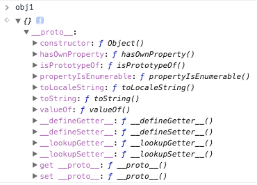
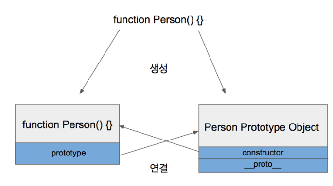
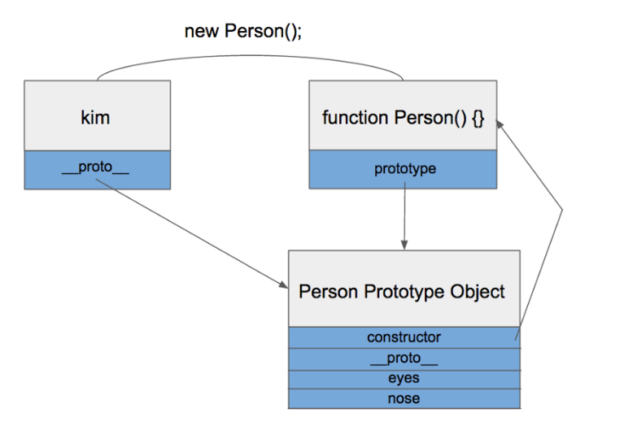
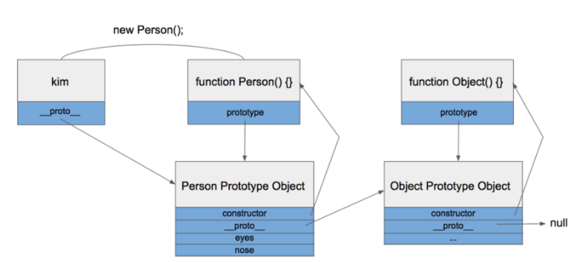
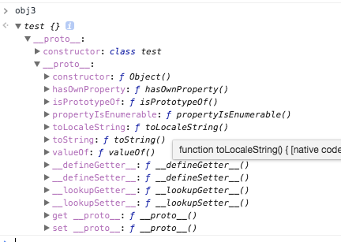
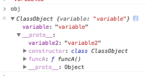

# JS - 어디까지 알고있나요 ?
## prototype 이해하기
<div class="pull-right"> 문스코딩 - 2018.03.13 </div>

---

<!-- @import "[TOC]" {cmd="toc" depthFrom=1 depthTo=6 orderedList=false} -->
<!-- code_chunk_output -->

* [JS - 어디까지 알고있나요 ?](#js-어디까지-알고있나요)
	* [prototype 이해하기](#prototype-이해하기)
		* [01. prototype vs class](#01-prototype-vs-class)
		* [02. 어디에 사용하나요 ?](#02-어디에-사용하나요)
		* [03. Prototype Object와 Prototype Link](#03-prototype-object와-prototype-link)
			* [3.1 Prototype Object](#31-prototype-object)
			* [3.2 Prototype Link == \_\_proto\_\_](#32-prototype-link-__proto__)
		* [class의 prototype 확인하기](#class의-prototype-확인하기)
		* [용어정리](#용어정리)

<!-- /code_chunk_output -->


### 01. prototype vs class

자바스크립트는 클래스가 없습니다.

대신 프로토타입이라는 것이 존재합니다.

자바스크립트가 프로토타입 기반 언어라고 불리는 이유입니다.

> 참고로 최근의 ECMA6 표준에서는 Class 문법이 추가되었습니다.
> 하지만 문법이 추가되었다는 것이지, 자바스크립트가 클래스 기반으로 바뀌었다는 것은 아닙니다.


### 02. 어디에 사용하나요 ?

```js
function Person() {
  this.eyes = 2;
  this.nose = 1;
}
var kim  = new Person();
var park = new Person();
console.log(kim.eyes);  // => 2
console.log(kim.nose);  // => 1
console.log(park.eyes); // => 2
console.log(park.nose); // => 1
```

kim과 park은 eyes와 nose를 공통적으로 가지고 있는데,
메모리에는 eyes와 nose가 두 개씩 총 4개 할당됩니다.
객체를100개 만들면 200개의 변수가 메모리에 할당되겠죠?
바로 이런 문제를 프로토타입으로 해결할 수 있습니다.

```js
function Person() {}
Person.prototype.eyes = 2;
Person.prototype.nose = 1;
var kim  = new Person();
var park = new Person():
console.log(kim.eyes); // => 2
```

자바스크립트 개발을 하시는 분이라면 아마 써보진 않았어도 최소한 본 적은 있을겁니다.
간단히 설명하자면 Person.prototype이라는 빈 Object가 어딘가에 존재하고,
Person 함수로부터 생성된 객체(kim, park)들은
어딘가에 존재하는 Object에 들어있는 값 (prototype)을 모두 갖다쓸 수 있습니다.
즉, eyes와 nose를 어딘가에 있는 빈 공간에 넣어놓고 kim과 park이 공유해서 사용하는 것이죠.


### 03. Prototype Object와 Prototype Link

자바스크립트에는 **Prototype Object 와 Prototype Link** 라는 것이 존재합니다.

그리고 이 둘을 통틀어 우리는 Prototype이라고 부릅니다.

instance를 생성하기전 prototype을 관리하기위해선 Class.protoype으로 처리할 수 있습니다.

> ES6에선 class 내부에 선언하는 함수가 prototype이 됩니다.

해당 class의 인스턴스가 생성되면 instance.\_\_proto\_\_에서 해당 프로토타입을 참조하기 때문에

class에 속성으로 없더라도 참조할 수 있게 되는 것입니다.

#### 3.1 Prototype Object

```js
function Person() {} // => 함수
var personObject = new Person(); // => 함수로 객체를 생성
```
personObject 객체는 Person이라는 함수로부터 파생된 객체입니다.
이렇듯 언제나 객체는 함수로부터 시작됩니다.

```js
var obj = {};
```
;

얼핏보면 함수랑 전혀 상관없는 코드로 보이지만 위 코드는 사실 다음 코드와 같습니다.

```js
var obj = new Object(); // = var obj = {};
```
위 코드에서 Object가 자바스크립트에서 기본적으로 제공하는 함수입니다.


그렇다면 이것이 Prototype Object랑 무슨 상관이있느냐? 함수가 정의될 때는 2가지 일이 동시에 이루어집니다.

- 해당 함수에 contructor(생성자) 자격 부여

Constructor 자격이 부여되면 new를 통해 객체를 만들어 낼 수 있게 됩니다.
이것이 함수만 new 키워드를 사용할 수 있는 이유입니다.

```js
var obj = {};
var instance = new obj(); // (X)
```

- 해당 함수의 Prototype Object 생성 및 연결

함수를 정의하면 함수만 생성되는 것이 아니라 Prototype Object도 같이 생성이 됩니다.



그리고 생성된 함수는 prototype이라는 속성을 통해 prototype object에 접근할 수 있습니다.

prototype object는 일반적인 객체와 같으며 기본적인 속성으로 constructor와 \_\_proto\_\_를 가지고 있습니다.

```js
function Person() {}
Person.prototype.eyes = 2;
Person.prototype.nose = 1;
var kim  = new Person();
var park = new Person():
console.log(kim.eyes); // => 2
```

Prototype Object는 일반적인 객체이므로 속성을 마음대로 추가/삭제 할 수 있습니다.
kim과 park은 Person 함수를 통해 생성되었으니 Person.prototype을 참조할 수 있게 됩니다.

Prototype Link를 보기 전에 Prototype Object를 어느 정도 이해하시고 보기 바랍니다.
함수가 정의될 때 이루어지는 일들을 이해하는 것이 두 번째 포인트,
Prototype Object를 이해하는 것이 세 번째 포인트입니다.

#### 3.2 Prototype Link == \_\_proto\_\_

kim에는 eyes라는 속성이 없는데도 kim.eyes를 실행하면 2라는 값을 참조하는 것을 볼 수 있습니다.
위에서 설명했듯이 Prototype Object에 존재하는 eyes 속성을 참조한 것인데요, 이게 어떻게 가능한걸까요??

바로 kim이 가지고 있는 딱 하나의 속성 \_\_proto\_\_가 그것을 가능하게 해주는 열쇠입니다.

prototype 속성은 함수만 가지고 있던 것과는 달리(Person.prototype 기억나시죠?)
\_\_proto\_\_속성은 모든 객체가 빠짐없이 가지고 있는 속성입니다.

\_\_proto\_\_는 객체가 생성될 때 조상이었던 함수의 Prototype Object를 가리킵니다.
kim객체는 Person함수로부터 생성되었으니 Person 함수의 Prototype Object를 가리키고 있는 것이죠.



kim객체가 eyes를 직접 가지고 있지 않기 때문에 eyes 속성을 찾을 때 까지 상위 프로토타입을 탐색합니다.
최상위인 Object의 Prototype Object까지 도달했는데도 못찾았을 경우 undefined를 리턴합니다.
이렇게 \_\_proto\_\_속성을 통해 상위 프로토타입과 연결되어있는 형태를 프로토타입 체인(Chain)이라고 합니다.



이런 프로토타입 체인 구조 때문에 모든 객체는 Object의 자식이라고 불리고,
Object Prototype Object에 있는 모든 속성을 사용할 수 있습니다.
한 가지 예를 들면 toString 함수가 있겠습니다.

### class의 prototype 확인하기

```js
class ClassObject {}
var obj = new ClassObject();
```



클래스로 생성된 객체는 기본적으로 \_\_proto\_\_를 가집니다.

해당 proto는 생성자와 다른 proto link를 가집니다.

더 자세히 살펴보겠습니다.

```js
class ClassObject {
    constructor() {
        this.variable = 'variable';
    }

    // [prototype]
    funcA() {
        console.log('funcA call');
    }
}

// [prototype]
ClassObject.prototype.variable2 = 'variable2'

var obj = new ClassObject();
```



다음을 보시면 ClassObject의 메소드는 prototype 영역으로 들어가는 것을 확인할 수 있습니다.

그러니까 즉, 클래스 내부에 생성하는 함수는 prototype으로 정적으로 설정되는 것입니다.

그렇기 때문에 외부에 prototype을 이용해서 생성하는 메소드와 같습니다.

### 용어정리
```
    prototype ::
    prototype-object ::
    prototype-link ::
```

---

**Created by SuperMoon**

**출처 : [SuperMoon's Git Blog](https://github.com/jm921106)**

[링크1 :: prototype 이해하기 ](https://medium.com/@bluesh55/javascript-prototype-%EC%9D%B4%ED%95%B4%ED%95%98%EA%B8%B0-f8e67c286b67)

[링크2 :: prototype 이해하기2](http://www.nextree.co.kr/p7323/)

Copyright (c) 2017 Copyright Holder All Rights Reserved.
