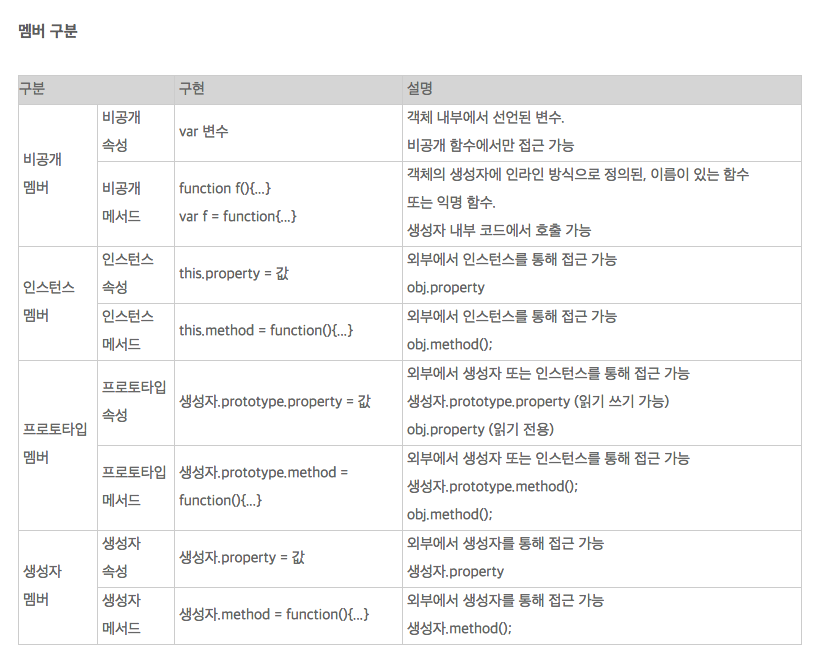

# JavaScript Pattern, 세상에 잘 짜여진 코드는 많다.
## JavaScript private 패턴으로 구현하기

<div class="pull-right"> 문스코딩 - 2018.01.dd </div>

---

<!-- @import "[TOC]" {cmd="toc" depthFrom=1 depthTo=6 orderedList=false} -->
<!-- code_chunk_output -->

* [JavaScript Pattern, 세상에 잘 짜여진 코드는 많다.](#javascript-pattern-세상에-잘-짜여진-코드는-많다)
	* [JavaScript private 패턴으로 구현하기](#javascript-private-패턴으로-구현하기)
		* [01. 객체의 범위](#01-객체의-범위)
		* [02. 변수 private](#02-변수-private)
			* [방법 1 :: _ 사용](#방법-1-_-사용)
			* [방법 2 :: Constructor에 할당](#방법-2-constructor에-할당)
			* [방법 3 :: Symbol](#방법-3-symbol)
			* [방법 4 :: WeakMap](#방법-4-weakmap)
			* [방법 5 :: ES7](#방법-5-es7)
		* [04. 함수 private](#04-함수-private)
			* [4.1 방법1 - "\_" 접두사 사용하기](#41-방법1-_-접두사-사용하기)
			* [4.2 방법2 - ES6에서 활용하기](#42-방법2-es6에서-활용하기)
			* [4.3 방법3 - Symbol 이용하기](#43-방법3-symbol-이용하기)
		* [비공개 private 어디까지 처리해야 할까요 ?](#비공개-private-어디까지-처리해야-할까요)
		* [private method를 상속할 수 있을까요 ?](#private-method를-상속할-수-있을까요)

<!-- /code_chunk_output -->


**용어정리**
```

```

### 01. 객체의 범위

객체 맴버 구분하기



- 비공개 맴버
	- 객체 내부에 선언되어서 외부에선 해당 객체에 접근할 수 없는 맴버입니다.
	- scope에 접근이 가능한 내부에서만 사용이 가능하기 떄문에 이것을 일반적으로 private로 생각하고 있습니다.

- 인스턴스 맴버
	- this.Proprty를 통해 선언되었으므로 인스턴스를 통해 해당 멤버에 접근이 가능합니다.

- 프로토타입 맴버
	- 외부에서 생성자 또는 인스턴스를 통해 접근이 가능합니다.

- 생성자 맴버
	- 외부에서 생성자를 통해 접근이 가능합니다.

### 02. 변수 private

IIFE 패턴 - 변수에 private 처리를 할때 많이 사용하는 패턴입니다.

~~해당 방식은 많이 설명했으므로 생략하도록 하겠습니다.~~

#### 방법 1 :: _ 사용

가짜 private입니다. 협업에서는 중요하나 개발자들은 가짜 private의 위험성에 대해서 이야기를 많이 합니다.

#### 방법 2 :: Constructor에 할당

해당 방식은 private 처리를 할 순 있으나, 클래스의 다양한 기능을 활용하진 못합니다.

#### 방법 3 :: Symbol

완변한 private는 아닙니다.

접근할 수 있는 몇가지 방법이 있습니다.

```js
const testSymbol = Object.getOwnPropertySymbols(test)[0];
test[testSymbol] = 20;
console.log(test.score);    // 20
console.log(test.inc());    // 21
```

```js
const testSymbol = Reflect.ownKeys(test)[0];
test[testSymbol] = 20;
console.log(test.score);    // 20
console.log(test.dec());    // 19
```

#### 방법 4 :: WeakMap

#### 방법 5 :: ES7

[추가예정]ES7에는 변수를 private할 수 있는 새로운 기준이 생겼습니다.

### 04. 함수 private

한 클래스에서 사용은 하지만 외부로 노출하고 싶지 않은 함수가 있습니다.

이럴 경우에 어떻게 함수를 private화 할 수 있을까요 ?

#### 4.1 방법1 - "\_" 접두사 사용하기

```js
class Hello {
    _world() { /*...*/ }
}
```
이 방식은 접두사로 "\_" 를 사용하는 것을 권합니다. 하지만, 이것은 진짜 해결책이라 볼 수 없습니다.

이 방식은 개발을 진행할때 메소드의 역할을 분별할 수 있는 좋은 키워드가 될 것이고,

다른 개발자들과의 협업에서도 많은 도움을 줄 수 있습니다.

#### 4.2 방법2 - ES6에서 활용하기

```js
const privateMethods = {
  privateMethod () {
    console.log(this.say);
  }
}

export default class Service {
  constructor () {
    this.say = "Hello";
  }

  publicMethod () {
    privateMethods.privateMethod.call(this);
  }
}
```

다음과 같은 방식은 .call(this)를 이용해서 객체의 속성을 private에 주입시키기때문에

클래스 내부의 함수라 생각해도 무방합니다.

하지만 필요한 곳에서만 가져다 쓰고 외부에는 노출 시키지 않을 수 있습니다.

#### 4.3 방법3 - Symbol 이용하기

```js
const privateMethod = Symbol('privateMethod');

export default class Service {
  constructor () {
    this.say = "Hello";
  }

  [privateMethod] () {
    console.log(this.say);
  }

  publicMethod () {
    this[privateMethod]()
  }
}

// Uncaught TypeError: (intermediate value).privateMethod is not a function
new Service().privateMethod()

// Uncaught TypeError: (intermediate value)[Symbol(...)] is not a function
new Service()[Symbol('privateMethod');
```

> 심볼을 scope에 이용하면 private 매소드를 만들 수 있습니다.

참고 블로그에서 가장 선호하는 방식은 Symbol이라 말합니다.

이는 call 메소드를 사용해서 lexical scoping을 변경할 필요가 없어, 명확하기 때문입니다.


### 비공개 private 어디까지 처리해야 할까요 ?

자바스크립트를 이용해서 프론트를 개발하다 보니 문득 IIFE 패턴을 이용한 비공개 처리를 어디까지 해야할까... 의문이 들었습니다.

결론은 가상 상단의 노출되는 Property만 비공개처리하면 내부 클래스의 Property는 확인할 수 없습니다.

물론 소스를 직접 디버그 하며 확인해서 처리한다면야 처리할 수 있지만,

난독화가 되기 때문에 그것 또한 쉬운 일은 아닙니다.

그렇기 때문에 비공개 Property를 처리할때는 가장 상단의 노출 Property만 비공개로 처리하면

내부 Proprty는 비공개로 하지 않아도 확인할 수 없습니다.


### private method를 상속할 수 있을까요 ?

JS에서 제시하는 대안은 scope를 이용한 처리인데,

자식 클래스에 가면 부모 클래스의 scope에는 접근할 수가 없습니다.

그래서 결국 scope를 이용한 private는 하위로 상속할수가 없는 것입니다.

그래서 접두사 "\_"를 이용해서 public 메소드를 만드는 등 다른 방법을 이용해야 합니다.

하지만 해당 방식으로 처리해도 \_public 메소드로 접근만 열어주는 것이지 해당 메소드를 확인할 방법은 없습니다.

> 다음편 jsPattern_protected에서 해결책을 알아보겠습니다.

---

**Created by SuperMoon**

**출처 : [SuperMoon's Git Blog](https://github.com/jm921106)**

[링크1 :: 자바스크립트 private 규칙 ](http://huns.me/development/516)

[링크2 :: 자바스트립트 public vs private 매소드 관리 방법 ](https://medium.com/@davidrhyswhite/private-members-in-es6-db1ccd6128a5)

[링크 :: 자바스크립트 private vs protected에 대한 고찰](https://philipwalton.com/articles/implementing-private-and-protected-members-in-javascript/)


Copyright (c) 2017 Copyright Holder All Rights Reserved.
